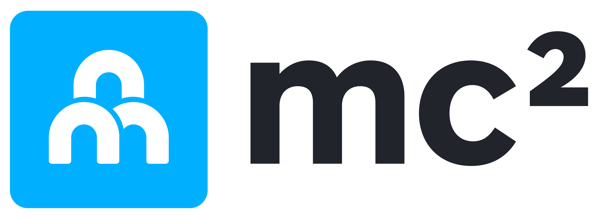
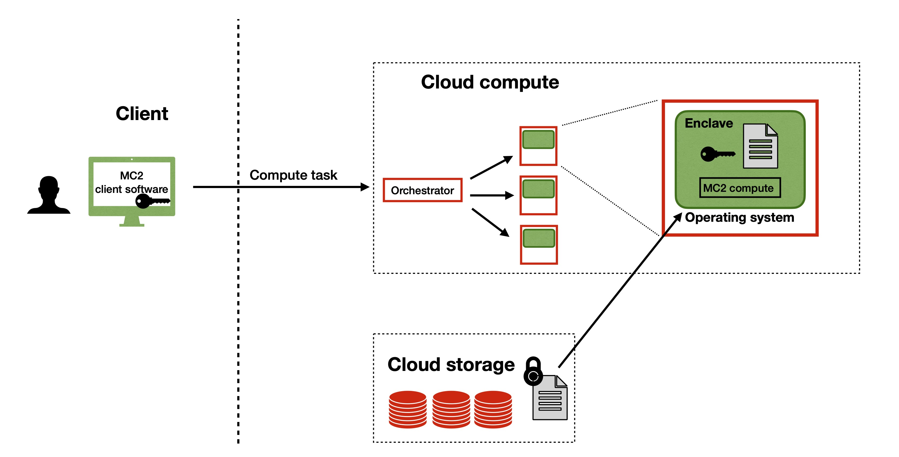

<p align="center">
  
</p>


# A Platform for Secure Analytics and Machine Learning


[](https://opensource.org/licenses/Apache-2.0)
[](https://join.slack.com/t/mc2-project/shared_invite/zt-rt3kxyy8-GS4KA0A351Ysv~GKwy8NEQ)
[](CODE_OF_CONDUCT.md)




Born out of research in the [UC Berkeley RISE Lab](https://rise.cs.berkeley.edu/), [MC<sup>2</sup>](https://mc2-project.github.io/) is a platform for running secure analytics and machine learning on encrypted data.
With MC<sup>2</sup>, users can outsource their confidential data workloads to the cloud, while ensuring that the data is never exposed unencrypted to the cloud provider. 
MC<sup>2</sup> also enables secure collaboration -- multiple data owners can use the platform to jointly analyze their collective data, without revealing their individual data to each other.

MC<sup>2</sup> provides the following (actively maintained) secure computation services:
* [Opaque SQL](https://github.com/mc2-project/opaque-sql): Encrypted data analytics on Spark SQL using hardware enclaves
* [Secure XGBoost](https://github.com/mc2-project/secure-xgboost): Collaborative XGBoost training and inference on encrypted data using hardware enclaves
* [Federated XGBoost](https://github.com/mc2-project/federated-xgboost): Collaborative XGBoost in the federated setting

The MC<sup>2</sup> project also includes exploratory research prototypes that develop new cryptographic techniques for secure computation. Please visit the individual project pages for more information:
* [Cerebro](https://github.com/mc2-project/cerebro): A general purpose Python DSL for learning with secure multiparty computation.
* [Delphi](https://github.com/mc2-project/delphi): Secure inference for deep neural networks.

For more information on MC<sup>2</sup>, visit our [website](https://mc2-project.github.io/).

This repository contains the source code for the **MC<sup>2</sup> client**, which enables users to easily interface with MC<sup>2</sup> services deployed remotely in the cloud. **Currently, the client supports remote deployments of Opaque SQL only.** Support for Secure XGBoost is coming soon.
To run an end-to-end MC<sup>2</sup> workflow:
1. Launch Opaque SQL in the cloud (instructions to do so can be found in the respective repositories) 
2. Use the MC<sup>2</sup> client to encrypt data locally, transfer it to the cloud VMs, run scripts specifying the desired computation, and retrieve and view encrypted results.

## Table of Contents
* [Installation](#installation)
* [Quickstart](#quickstart)
* [Documentation](#documentation)
* [Contact](#contact)


## Installation
To quickly play with MC<sup>2</sup> Client and Opaque SQL, you can use the provided Dockerfile to build a container (takes ~7 min) with all MC<sup>2</sup> Client and Opaque SQL dependencies. Alternatively, you can pull a pre-built Docker image instead of building one. To do either, you must have [Docker](https://docs.docker.com/get-docker/) installed.

The container will have the contents of this `mc2` directory at `/mc2/client`, and Opaque SQL will be at `/mc2/opaque-sql`

For ease of use, we recommend that you create a directory within your host `mc2` directory that will serve as your playground, and then mount your `playground` directory to the Docker container. Mounting will ensure that changes you make in your `playground` directory outside the container will be reflected inside the container, and vice versa. If you're bringing your own data, you can either copy your data over to your playground directory, or separately mount your data directory to the container.

### Installation via building an image
```sh
# Clone the `mc2-project/mc2 repo`
git clone https://github.com/mc2-project/mc2.git

# Build a Docker image called `mc2_img`
docker build -t mc2_img .

# Run the container, mounting your playground to the container, and open a shell into the container
docker run -it -v </absolute/path/to/mc2/playground>:/mc2/client/playground mc2_img /bin/bash
```

### Installation via pulling an image
If you prefer to pull the image instead, you can pull a pre-built image (~3 GB) from Docker Hub.

```
# Clone the `mc2-project/mc2 repo`
git clone https://github.com/mc2-project/mc2.git

# Pull the mc2_img from Docker Hub
docker pull mc2project/mc2_img:v0.1.3

# Run the container, mounting your playground to the container, and open a shell into the container
docker run -it -v </absolute/path/to/mc2/playground>:/mc2/client/playground mc2_img /bin/bash
```

### Installation via build from source
Alternatively, if you'd like to install MC<sup>2</sup> Client directly on your host, follow [these instructions](https://mc2-project.github.io/client-docs/install.html).

## Quickstart
This quickstart will give you a flavor of using MC<sup>2</sup> with Opaque SQL, and can be entirely done locally with Docker if desired. You will use MC<sup>2</sup> Client to encrypt some data, transfer the encrypted data to a remote machine, run an Opaque SQL job on the encrypted data on the remote machine, and retrieve and decrypt the job's encrypted results. To run everything securely, you can choose to spin up Opaque SQL on Azure VMs with SGX-support. Alternatively, to get a flavor of MC<sup>2</sup> without having to use Azure, you can use the deployment of Opaque SQL in the Docker container.

MC<sup>2</sup> Client provides a command line interface that enables you to remotely interact with MC<sup>2</sup> compute services. The CLI relies on a configuration file that you should modify before each step in this quickstart to tell MC<sup>2</sup> Client what exactly you want to do. An example of the configuration file is [here](demo/config.yaml).

The dataset we'll be using in this quickstart is a medical dataset containing patient records. Here's a couple of sample records for reference.

  ```sh
  Age,BMI,Glucose,Insulin,HOMA,Leptin,Adiponectin,Resistin,MCP.1,Classification
  48,23.5,70,2.707,0.467408667,8.8071,9.7024,7.99585,417.114,1
  83,20.69049454,92,3.115,0.706897333,8.8438,5.429285,4.06405,468.786,1
  82,23.12467037,91,4.498,1.009651067,17.9393,22.43204,9.27715,554.697,1
  ```

If you get stuck at any point while running the quickstart, feel free to ping us on [Slack](https://join.slack.com/t/mc2-project/shared_invite/zt-rt3kxyy8-GS4KA0A351Ysv~GKwy8NEQ).

### Docker Quickstart
If you'd like to try everything out locally, you can do so within the Docker container you built in the [installation](#installation) section.

1. In the container, copy the contents of the `quickstart` directory to your mounted `playground` directory to ensure that your changes inside the container get reflected on your host. Then, configure MC<sup>2</sup> Client with your configuration file.

    ```sh
    # From the /mc2/client directory
    cp -r quickstart/* playground
    mc2 configure $(pwd)/playground/config.yaml
    ```

1. Generate a keypair and a symmetric key that MC<sup>2</sup> Client will use to encrypt your data. Specify your username and output paths in the `user` section of the configuration file. Then, generate the keys.

    ```sh
    mc2 init
    ```

1. Start [Opaque SQL](https://mc2-project.github.io/opaque-sql-docs/src/index.html), a MC<sup>2</sup> service for secure SQL analytics.
    
    ```sh
    mc2 start
    ```

1. Prepare your data for computation by encrypting and uploading it. This step uses the keys you generated in step 2 to encrypt your data. Note that "uploading" here means copying because we have a local deployment.


    ```sh
    mc2 upload
    ```

1. Run the provided Opaque SQL quickstart script, to be executed by MC<sup>2</sup>. The script can be found [here](quickstart/opaque_sql_demo.scala), and performs a filter operation over our data -- the results will contain records of all patients who are younger than 30 years old. Results are encrypted by MC<sup>2</sup> before being saved, and can only be decrypted with the key you used to encrypt your data in the previous step.

    ```sh
    mc2 run
    ```

1. Once computation has finished, you can retrieve your encrypted results and decrypt them. Results are saved in the `results/` directory. You can view the results by looking at `results/opaque_sql_result.dec`

    ```sh
    mc2 download
    ```

### Azure Quickstart
You can also choose to run this quickstart with enclave-enabled VMs on the cloud with Azure Confidential Computing. Unlike the Docker quickstart, in this quickstart you'll first launch enclave-enabled VMs on Azure using MC<sup>2</sup> before uploading data and runing computation. 

1. Start off in the container you built in the [installation](#installation) section. In the container, copy the contents of the `quickstart` directory to your mounted "playground" directory to ensure that your changes inside the container get reflected on your host. Otherwise, no need to do anything. Then, configure MC<sup>2</sup> Client with your configuration file.

    ```sh
    # From the /mc2/client directory
    cp -r quickstart/* playground
    mc2 configure $(pwd)/playground/config.yaml
    ```

1. Generate a keypair and a symmetric key that MC<sup>2</sup> Client will use to encrypt your data. Specify your username and output paths in the `user` section of the configuration file. Then, generate the keys.

    ```sh
    mc2 init
    ```

1. Next, launch the machines and resources you'll be using for computation. This step does not exist in the Docker quickstart. MC<sup>2</sup> Client provides an interface to launch resources on Azure (and sets up the machines with necessary dependencies). Take a look at the `launch` section of the configuration file -- you'll need to specify the path to your [Azure configuration file](quickstart/azure.yaml), which is a YAML file that details the names and types of various resources you will launch. 

    Next, log in to Azure through the command line and set your subscription ID. [Here](https://docs.microsoft.com/en-us/azure/media-services/latest/setup-azure-subscription-how-to?tabs=portal) are instructions on how to find your subscription ID.

    ```sh
    az login
    az account set -s <YOUR_SUBSCRIPTION_ID>
    ```
    Once you've done that, launch the resources.

    ```sh
    mc2 launch
    ```

1. Start [Opaque SQL](https://mc2-project.github.io/opaque-sql-docs/src/index.html), a MC<sup>2</sup> service for secure SQL analytics.
    
    ```sh
    mc2 start
    ```

1. Prepare your data for computation by encrypting and uploading it. This step uses the keys you generated in step 2 to encrypt your data. Note that "uploading" here means copying because we have a local deployment.

    ```sh
    mc2 upload
    ```

1. Run the provided Opaque SQL quickstart script, to be executed by MC<sup>2</sup>. The script can be found [here](quickstart/opaque_sql_demo.scala), and performs a filter operation over our data -- the results will contain records of all patients who are younger than 30 years old. Results are encrypted by MC<sup>2</sup> before being saved, and can only be decrypted with the key you used to encrypt your data in the previous step.

    ```sh
    mc2 run
    ```

1. Once computation has finished, you can retrieve your encrypted results and decrypt them. Results are saved in the `results/` directory. You can view the results by looking at `results/opaque_sql_result.dec`

    ```sh
    mc2 download
    ```

1. Once you've finished using your Azure resources, you can use MC<sup>2</sup> Client to terminate them. You can specify which resources to terminate in the `teardown` section of the configuration.
    
    ```sh
    mc2 teardown
    ```

## Documentation
For more thorough documentation MC<sup>2</sup> Client and Opaque SQL, please visit:

* [MC<sup>2</sup> Client](https://mc2-project.github.io/client-docs/index.html)
* [Opaque SQL](https://mc2-project.github.io/opaque-sql-docs/src/index.html)

## Contact
Join our [Slack](https://join.slack.com/t/mc2-project/shared_invite/zt-rt3kxyy8-GS4KA0A351Ysv~GKwy8NEQ), open a [GitHub issue](https://github.com/mc2-project/mc2/issues), or send a message to mc2-dev@googlegroups.com.
