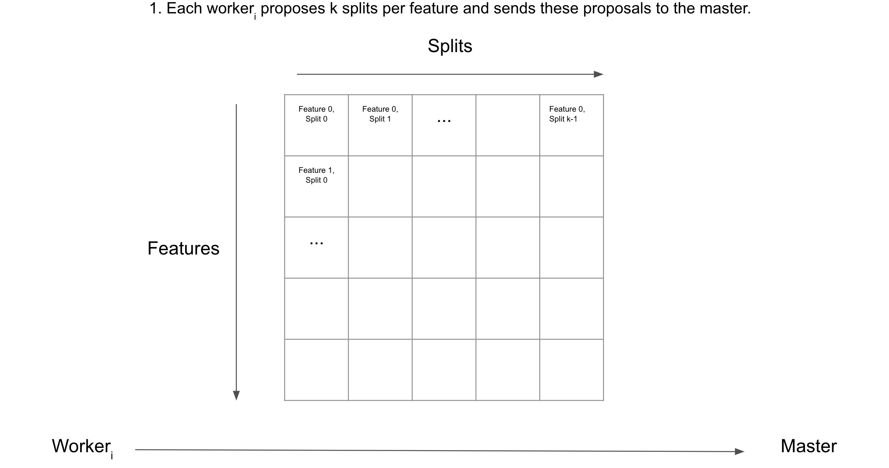
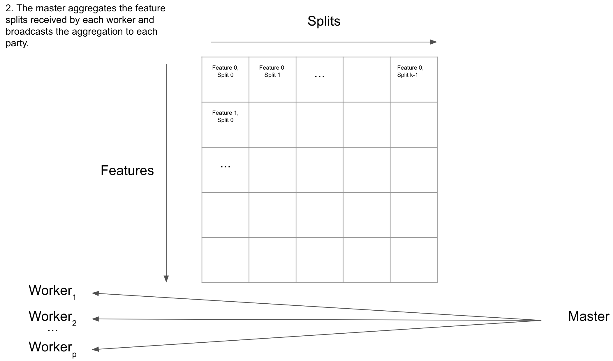
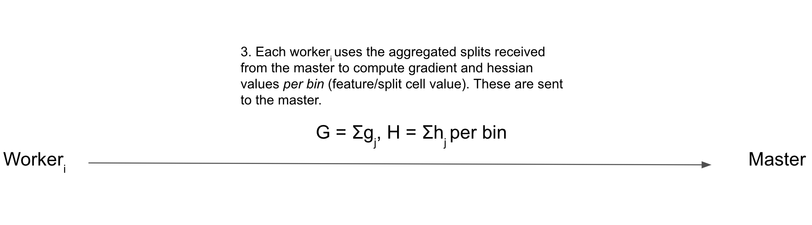
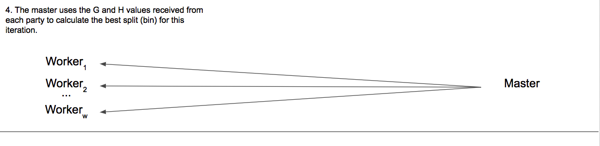

# Visualizing Federated XGBoost

## High Level

## Finding a Split

   

   

   

   

The above four steps are looped to create one decision tree. Stopping conditions include

* reaching the `max_depth` configurable parameter in the training method.  
* when no split is found to give a benefit score greater than some specified value gamma.  
* when metrics tested against a validation set are not improving once every k number of rounds, where k is configurable.
